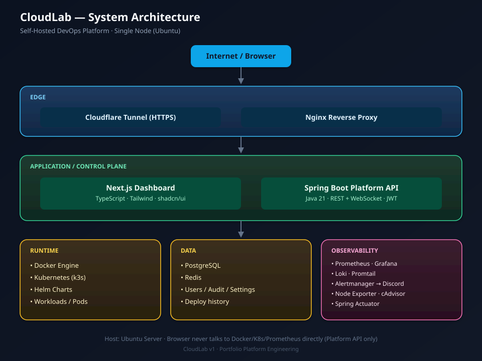
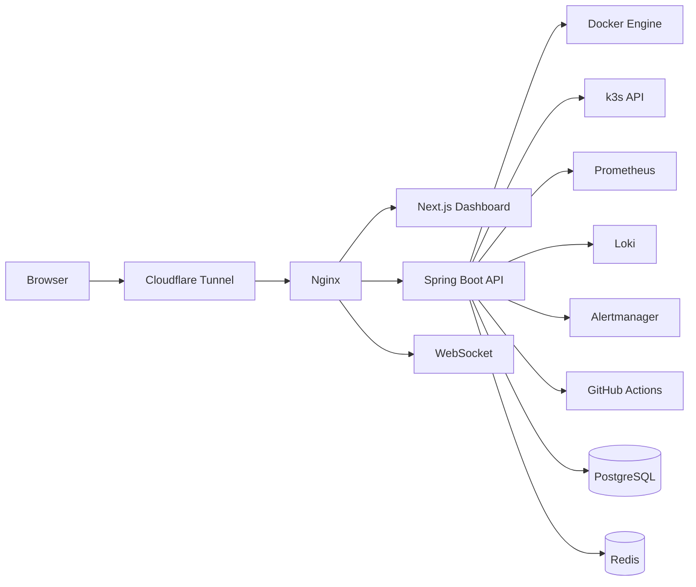
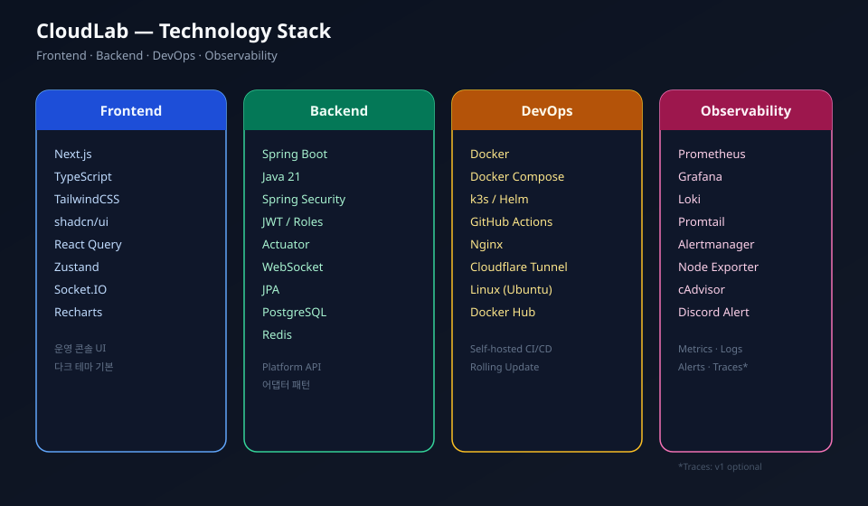
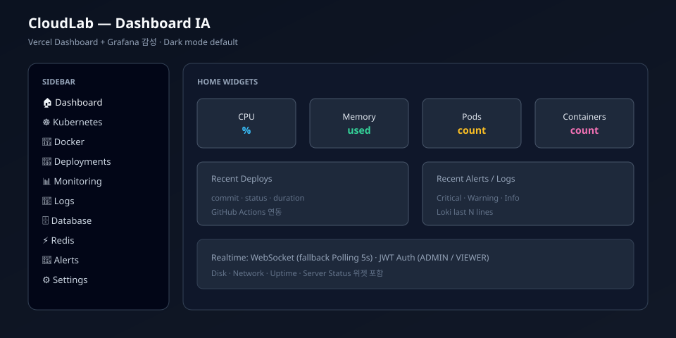
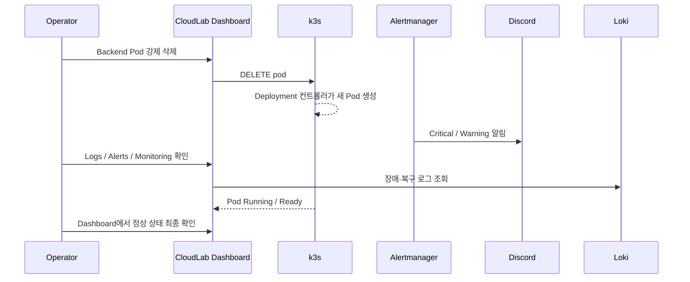

# CloudLab

### Self-Hosted DevOps Platform

<p align="center">
  
</p>

<p align="center">
  <strong>브라우저 하나로 서버 · Kubernetes · Docker · 배포 · 로그 · 모니터링 · 알림을 운영하는<br/>개인용 내부 운영 플랫폼 (Platform Engineering Portfolio)</strong>
</p>

<p align="center">
  
  
  
  
  
  
  
  
</p>

---

## 목차

1. [프로젝트 소개](#1-프로젝트-소개)
2. [왜 CloudLab인가](#2-왜-cloudlab인가)
3. [시스템 아키텍처](#3-시스템-아키텍처)
4. [기술 스택](#4-기술-스택)
5. [프로젝트 구조](#5-프로젝트-구조)
6. [설치 방법](#6-설치-방법)
7. [Docker 구성](#7-docker-구성)
8. [Kubernetes 구성](#8-kubernetes-구성)
9. [CI/CD 파이프라인](#9-cicd-파이프라인)
10. [모니터링 구성](#10-모니터링-구성)
11. [로그 수집 구성](#11-로그-수집-구성)
12. [Dashboard 설명](#12-dashboard-설명)
13. [Backend API 개요](#13-backend-api-개요)
14. [보안](#14-보안)
15. [장애 복구 시나리오](#15-장애-복구-시나리오)
16. [면접 데모 (5분)](#16-면접-데모-5분)
17. [성능 테스트](#17-성능-테스트)
18. [트러블슈팅](#18-트러블슈팅)
19. [개발 로드맵](#19-개발-로드맵)
20. [향후 개선 사항 (v2)](#20-향후-개선-사항-v2)
21. [문서 링크](#21-문서-링크)
22. [커밋 컨벤션](#22-커밋-컨벤션)
23. [라이선스](#23-라이선스)

---

## 1. 프로젝트 소개

**CloudLab**은 상용 클라우드 콘솔(예: AWS Console)처럼 동작하는 **Self-Hosted DevOps / 내부 운영 플랫폼**이다.

사용자는 웹 브라우저만으로 다음을 수행할 수 있어야 한다.

| 영역 | 할 수 있는 일 |
|------|----------------|
| 인프라 현황 | 서버 CPU · Memory · Disk · Network · Uptime 확인 |
| 오케스트레이션 | Kubernetes(k3s) Pod / Deployment 조회 · 재시작 · 스케일 · 롤링 업데이트 |
| 컨테이너 | Docker 컨테이너 Start / Stop / Restart / Logs / Inspect |
| 배포 | GitHub Actions 연동 배포 · 롤백 · 진행률 확인 |
| 관측 | Prometheus 메트릭 차트, Loki 로그 스트리밍, Alertmanager 알림 |
| 데이터 | PostgreSQL / Redis 상태 조회 |
| 운영 | Discord 장애 알림, JWT 로그인(Admin / Viewer) |

> **웹 서비스 자체가 목적이 아니다.**  
> **DevOps 운영 플랫폼을 설계·구축·운영하는 역량**을 증명하는 것이 목적이다.

| 항목 | 내용 |
|------|------|
| **제품 유형** | 실무에서 Platform Engineer가 만드는 **내부 운영 플랫폼** 수준 |
| **포지션** | Cloud / DevOps / Platform / SRE 취업 포트폴리오 |
| **호스팅** | 단일 Ubuntu 서버 기준 Self-Hosted (유료 클라우드 관리형 서비스 의존 최소화) |
| **현재 단계** | Step 11 완료 — 테스트 강화 (JUnit · Vitest · CI) |
| **저장소** | https://github.com/jinhgit/cloudlab |
| **상세 요구사항** | [docs/PRD.md](../docs/PRD.md) |

---

## 2. 왜 CloudLab인가

많은 포트폴리오가 “Docker로 앱 띄우기” 또는 “k8s 매니페스트 몇 개”에서 끝난다.  
CloudLab은 그 위에 **운영 콘솔 + 관측 + CI/CD + 장애 복구 스토리**를 한 제품으로 묶는다.

| 구분 | 일반적인 실습 | CloudLab |
|------|----------------|----------|
| 목표 | 기술 스택 나열 | **운영 플랫폼 제품** |
| UI | 없거나 Grafana만 | **자체 Dashboard** (Vercel + Grafana 감성) |
| 데이터 | Mock / 스크린샷 | **실데이터** (Docker · k3s · Prometheus · Loki) |
| 배포 | 수동 또는 스크립트 | **GitHub Actions + Rolling Update + Health Check** |
| 장애 | 문서에만 존재 | **Pod 삭제 → 자동 복구 → Discord → Logs** 시연 |
| 성장 | 일회성 | **v1 운영 플랫폼 → v2 IaC(Terraform/Ansible)** |

포트폴리오에서 보여 주는 역량 맵:

| Domain | Skills |
|--------|--------|
| OS / Runtime | Linux, Docker, Docker Compose |
| Orchestration | Kubernetes (k3s), Helm |
| Delivery | GitHub Actions, CI/CD, Rolling Update |
| Observability | Prometheus, Grafana, Loki, Alertmanager |
| Edge | Nginx Reverse Proxy, Cloudflare Tunnel |
| Application | Spring Boot (Java 21), Next.js (TypeScript) |
| Platform | 통합 API, JWT RBAC, 운영 UX |

---

## 3. 시스템 아키텍처

### 3.1 한눈에 보기

<p align="center">
  
</p>

```text
                       Internet
                            │
                   Cloudflare Tunnel
                            │
                    Nginx Reverse Proxy
                            │
────────────────────────────────────────────────────
             CloudLab Dashboard (Next.js)
────────────────────────────────────────────────────
               REST API + WebSocket
────────────────────────────────────────────────────
               Spring Boot Platform API
────────────────────────────────────────────────────
 Docker Engine · Kubernetes(k3s) · PostgreSQL · Redis
 Prometheus · Grafana · Loki · Alertmanager
 Node Exporter · cAdvisor
────────────────────────────────────────────────────
             Ubuntu Server
```

### 3.2 요청 경로 (Request Path)



### 3.3 계층별 역할

| Layer | Component | Responsibility |
|-------|-----------|----------------|
| Edge | **Cloudflare Tunnel** | 공인 IP/포트 직접 노출 없이 HTTPS 진입 |
| Edge | **Nginx** | 경로 라우팅 (`/`, `/api`, `/ws`), 리버스 프록시 |
| UI | **Next.js Dashboard** | 운영 콘솔, 차트, 실시간 상태 |
| Control | **Spring Boot Platform API** | Docker/K8s/Prometheus/Loki/Deploy **단일 통합 API** |
| Data | **PostgreSQL** | 사용자, 설정, 감사 로그, 배포 이력 |
| Cache | **Redis** | 세션·캐시·실시간 보조 |
| Runtime | **Docker Engine** | 컨테이너 실행·조회 |
| Orchestration | **k3s + Helm** | 워크로드 오케스트레이션 |
| Metrics | **Prometheus + Exporters** | 메트릭 수집·저장·질의 |
| Logs | **Loki + Promtail** | 로그 수집·질의 |
| Alerts | **Alertmanager** | Critical/Warning 라우팅 → Discord |
| Viz (보조) | **Grafana** | 심화 시각화 (1차 UI는 CloudLab Dashboard) |

### 3.4 핵심 설계 원칙

1. **브라우저가 Docker socket / kubeconfig / Prometheus 관리자 권한에 직접 접근하지 않는다.**  
   모든 인프라 연동은 Platform API 어댑터를 거친다.
2. **실데이터 우선.** 영구 Mock 금지. 서비스 미구축 단계에서만 어댑터 뒤에 임시 Mock.
3. **Realtime:** WebSocket 우선, 실패 시 REST Polling(기본 5초).
4. **보안:** JWT + Role(`ADMIN` / `VIEWER`), 시크릿은 환경변수 분리.

상세: [docs/architecture.md](../docs/architecture.md)

---

## 4. 기술 스택

<p align="center">
  
</p>

### 4.1 Frontend (Dashboard)

| Tech | 역할 |
|------|------|
| **Next.js** | App Router 기반 운영 콘솔 |
| **TypeScript** | 타입 안전성 |
| **TailwindCSS** | 유틸리티 스타일링 |
| **shadcn/ui** | 현대적 UI 컴포넌트 (다크 테마) |
| **React Query** | 서버 상태 / Polling |
| **Zustand** | 클라이언트 UI 상태 |
| **Socket.IO (client)** | 실시간 스트림 |
| **Recharts** | 메트릭 차트 |

### 4.2 Backend (Platform API)

| Tech | 역할 |
|------|------|
| **Spring Boot** | 통합 Platform API |
| **Java 21** | 런타임 |
| **Spring Security + JWT** | 로그인 · 인가 |
| **Spring Actuator + Micrometer** | 헬스 · JVM/HTTP 메트릭 |
| **WebSocket** | 실시간 푸시 |
| **Spring Data JPA** | 영속성 |
| **PostgreSQL** | 주 데이터베이스 |
| **Redis** | 캐시 / 세션 |

### 4.3 DevOps / Infrastructure

| Tech | 역할 |
|------|------|
| **Docker / Docker Compose** | 이미지 빌드 · 로컬·호스트 스택 |
| **k3s** | 경량 Kubernetes (단일 노드에 적합) |
| **Helm** | 차트 기반 배포 |
| **GitHub Actions** | CI/CD |
| **Nginx** | Reverse Proxy |
| **Cloudflare Tunnel** | 안전한 외부 진입 |
| **Docker Hub** (또는 동등 레지스트리) | 이미지 저장소 |

### 4.4 Observability

| Tech | 역할 |
|------|------|
| **Prometheus** | 메트릭 TSDB · 질의 |
| **Grafana** | 보조 대시보드 |
| **Loki** | 로그 저장 · 질의 |
| **Promtail** | 로그 수집 에이전트 |
| **Alertmanager** | 알림 라우팅 |
| **Node Exporter** | 호스트 메트릭 |
| **cAdvisor** | 컨테이너 메트릭 |
| **Discord Webhook** | 장애/배포 알림 채널 |

### 4.5 의도적으로 v1에서 하지 않는 것

| Non-Goal (v1) | 이유 |
|---------------|------|
| 멀티 클러스터 / 멀티 테넌시 | 범위 과다 |
| EKS · CloudWatch 등 관리형 의존 | Self-Hosted 철학 |
| Terraform / Ansible 풀 IaC | **v2 로드맵**으로 분리 |
| 완전한 SaaS 과금 모델 | 포트폴리오 운영 플랫폼 초점 |

---

## 5. 프로젝트 구조

```text
cloudlab/                          # repository root
├── frontend/                      # Next.js Dashboard
│   ├── app/                       # routes (App Router)
│   ├── components/                # UI components (shadcn)
│   ├── hooks/                     # React hooks
│   ├── services/                  # API / WS clients
│   ├── store/                     # Zustand stores
│   └── types/                     # shared TS types
│
├── backend/                       # Spring Boot Platform API
│   └── src/main/java/com/cloudlab/
│       ├── controller/            # REST endpoints
│       ├── service/               # business + adapters
│       ├── repository/            # JPA
│       ├── websocket/             # realtime channels
│       └── monitoring/            # metrics helpers
│
├── docker/                        # Dockerfiles
├── kubernetes/                    # k3s manifests / Helm
├── monitoring/                    # Prometheus · Grafana · Alertmanager
├── logging/                       # Loki · Promtail
├── nginx/                         # reverse proxy config
├── scripts/                       # bootstrap · backup · demo helpers
├── docs/                          # PRD · architecture · plans
│   └── assets/                    # README diagrams (SVG)
├── .github/
│   └── README.md                  # 프로젝트 README (루트 아님 — 여기 유지)
├── .env.example                   # 환경변수 템플릿 (시크릿 값 없음)
└── AGENTS.md                      # AI 개발 계약 (바이브코딩 규칙)
```

| 문서 | 설명 |
|------|------|
| [docs/PRD.md](../docs/PRD.md) | 제품 요구사항 · Decision Log |
| [docs/architecture.md](../docs/architecture.md) | 아키텍처 상세 |
| [docs/api-contract.md](../docs/api-contract.md) | API envelope · 역할 |
| [docs/demo-scenario.md](../docs/demo-scenario.md) | 면접 5분 스크립트 |
| [docs/development-plan.md](../docs/development-plan.md) | 12 Step 진행 현황 |
| [AGENTS.md](../AGENTS.md) | AI/개발 규칙 · 커밋/푸시 정책 |

---

## 6. 설치 방법

> **현재(Step 1):** 문서·디렉터리 골격 상태입니다.  
> 실행 가능한 전체 스택은 **Step 2~9** 완료 후 이 섹션 명령을 기준으로 동작합니다.

### 6.1 사전 요구 사항 (목표 환경)

| 항목 | 권장 |
|------|------|
| OS | Ubuntu 22.04+ (또는 동등 Linux) |
| CPU / RAM | 4 vCPU / 8GB+ (관측 스택 포함 시) |
| 도구 | Docker, Docker Compose, git |
| 오케스트레이션 | k3s |
| 계정 | Docker Hub, GitHub, Cloudflare(선택), Discord Webhook |

### 6.2 빠른 시작 (예정 플로우)

```bash
# 1) 클론
git clone https://github.com/jinhgit/cloudlab.git
cd cloudlab

# 2) 환경변수
cp .env.example .env

# 3) 권장: Docker Compose 풀 스택 (Step 5)
./scripts/compose-up.sh
# Dashboard  http://localhost:3000
# API        http://localhost:8080/actuator/health

# 4) 또는 개별 개발
# export JAVA_HOME="$(/usr/libexec/java_home -v 21)"
# cd backend && ./gradlew bootRun
# cd frontend && cp .env.example .env.local && npm install && npm run dev
```

### 6.3 환경변수 요약

[`.env.example`](../.env.example) 에 키가 정의되어 있다. **`.env` 는 절대 커밋하지 않는다.**

| 그룹 | 예시 키 | 용도 |
|------|---------|------|
| Frontend | `NEXT_PUBLIC_API_URL`, `NEXT_PUBLIC_WS_URL` | API / WS 엔드포인트 |
| Backend | `JWT_SECRET`, `CLOUDLAB_ADMIN_*` | 인증 · 초기 관리자 |
| DB | `POSTGRES_*` | PostgreSQL 접속 |
| Cache | `REDIS_*` | Redis 접속 |
| Runtime | `DOCKER_HOST`, `KUBECONFIG` | API 컨테이너 전용 |
| Observability | `PROMETHEUS_URL`, `LOKI_URL`, `ALERTMANAGER_URL` | 업스트림 URL |
| Integrations | `GITHUB_TOKEN`, `DISCORD_WEBHOOK_URL` | 배포 · 알림 |
| Edge | `CLOUDFLARE_TUNNEL_TOKEN` | 터널 (선택) |

### 6.4 개발 순서 (반드시 준수)

PRD Development Rules:

1. 프로젝트 구조 → 2. Docker → 3. Spring Boot → 4. Next.js  
5. Docker Compose → 6. Kubernetes → 7. Monitoring → 8. Logging  
9. CI/CD → 10. Dashboard 실연동 → 11. 테스트 → 12. README 완성  

현황: [docs/development-plan.md](../docs/development-plan.md)

---

## 7. Docker 구성

| 경로 | 내용 |
|------|------|
| [`docker/Dockerfile.backend`](../docker/Dockerfile.backend) | Spring Boot API (Java 21, multi-stage, non-root 10001) |
| [`docker/Dockerfile.frontend`](../docker/Dockerfile.frontend) | Next.js Dashboard (Node 22, standalone, non-root 10001) |
| [`docker/scripts/backend-entrypoint.sh`](../docker/scripts/backend-entrypoint.sh) | `JAVA_OPTS` · 의존 서비스 대기 |
| [`scripts/docker-build.sh`](../scripts/docker-build.sh) | 루트 컨텍스트 빌드 헬퍼 |
| [`docker-compose.yml`](../docker-compose.yml) | postgres · redis · backend · frontend (Step 5 **done**) |

설계 문서: [docs/docker.md](../docs/docker.md)

### 설계 포인트

- **멀티 스테이지 빌드**로 런타임 이미지 최소화
- Platform API 컨테이너만 `docker.sock` / kubeconfig 마운트 (프론트엔드는 불가)
- 이미지 태그: **`git SHA`** 기본, `main` 에 한해 `latest` 병행
- HEALTHCHECK 내장 (backend TCP/port, frontend HTTP)

```bash
# Step 3/4 앱 소스 준비 후
./scripts/docker-build.sh backend local
./scripts/docker-build.sh frontend local
```

```text
# 개념적 이미지 흐름
Gradle/Next build → docker build → push registry → k3s pull → Rolling Update
```

> Step 2 완료: Dockerfile 초안. **실제 이미지 빌드 성공은 Step 3(backend) · Step 4(frontend) 이후.**

---

## 8. Kubernetes 구성

| 항목 | 내용 |
|------|------|
| 런타임 | **k3s** (단일 노드 Self-Hosted) |
| 매니페스트 | `kubernetes/manifests/` + `kustomization.yaml` |
| Helm | `kubernetes/helm/cloudlab/` |
| 문서 | [docs/kubernetes.md](../docs/kubernetes.md) |

```bash
./scripts/k8s-import-images.sh local
./scripts/k8s-apply.sh manifests   # 또는 helm
kubectl -n cloudlab get pods
# NodePort UI :30080 · API :30088
```

| Workload | 역할 |
|----------|------|
| cloudlab-postgres / redis | 데이터 플레인 |
| cloudlab-backend | Platform API (RollingUpdate, Actuator probes) |
| cloudlab-frontend | Dashboard |
| Ingress / NodePort | 외부 접근 |

면접 데모: `kubectl -n cloudlab delete pod -l app.kubernetes.io/name=cloudlab-backend` → 자동 복구

---

## 9. CI/CD 파이프라인

```text
Push/PR → CI (test · build)
main    → CD (image push · optional SSH deploy · health · Discord)
```

| Workflow | 파일 |
|----------|------|
| CI | [`.github/workflows/ci.yml`](workflows/ci.yml) |
| CD | [`.github/workflows/cd.yml`](workflows/cd.yml) |

```bash
# 필수 secrets (레지스트리 push)
gh secret set DOCKERHUB_USERNAME
gh secret set DOCKERHUB_TOKEN
# 선택: DEPLOY_HOST, DEPLOY_SSH_KEY, DISCORD_WEBHOOK_URL
```

상세: [docs/cicd.md](../docs/cicd.md)

---

## 10. 모니터링 구성

| Component | Port | 역할 |
|-----------|------|------|
| Prometheus | 9090 | scrape · rules |
| Grafana | 3001 | 보조 대시보드 |
| Alertmanager | 9093 | 알림 라우팅 |
| Node Exporter | 9100 | 호스트 메트릭 |
| cAdvisor | 8081 | 컨테이너 메트릭 |
| Spring Actuator | `/actuator/prometheus` | JVM/HTTP |

```bash
./scripts/monitoring-up.sh
# targets: http://localhost:9090/targets
```

상세: [docs/monitoring.md](../docs/monitoring.md)

CloudLab Monitoring 페이지(1차 UI)는 Step 10에서 Prometheus API 연동.

---

## 11. 로그 수집 구성

| Component | Port | 역할 |
|-----------|------|------|
| Loki | 3100 | 로그 저장 · Query API |
| Promtail | 9080 | Docker SD → Loki push |
| Grafana | 3001 | Explore (Loki DS) |

```bash
./scripts/logging-up.sh
curl -s http://localhost:3100/ready
# LogQL: {compose_service="backend"}
```

상세: [docs/logging.md](../docs/logging.md)

CloudLab Logs 페이지 실연동은 Step 10.

---

## 12. Dashboard 설명

<p align="center">
  
</p>

### 12.1 UI 원칙

| 항목 | 스펙 |
|------|------|
| 테마 | **다크 모드 기본** |
| 룩앤필 | Vercel Dashboard + Grafana |
| 컴포넌트 | **shadcn/ui + TailwindCSS only** |
| 레이아웃 | 좌측 Sidebar + 헤더(환경/연결 상태) + 메인 |
| 실시간 | WebSocket 연결 표시, 실패 시 Polling |

### 12.2 사이드바 메뉴

| Menu | 역할 |
|------|------|
| 🏠 **Dashboard** | 서버·리소스 요약, Container/Pod 수, 최근 Deploy/Alert/Log |
| ☸ **Kubernetes** | Pod/Deployment 목록·상세·조작 |
| 🐳 **Docker** | 컨테이너 목록·Start/Stop/Restart/Logs/Inspect |
| 🚀 **Deployments** | GitHub Actions / 배포·롤백·진행률 |
| 📊 **Monitoring** | Prometheus 기반 차트 |
| 📜 **Logs** | Loki 검색·스트리밍 |
| 🗄 **Database** | PostgreSQL 크기·커넥션·테이블·백업 상태 등 |
| ⚡ **Redis** | Memory, Key Count, Hit Ratio, Eviction 등 |
| 🚨 **Alerts** | Alertmanager Critical/Warning/Info · ACK |
| ⚙ **Settings** | API URL, Polling, Dark Mode, Token/Webhook (서버 측 시크릿) |

### 12.3 Home 위젯

- Server Status, CPU, Memory, Disk, Network, Uptime  
- Container Count, Pod Count  
- Recent Deploy / Alert / Log  
- 실시간: **5초 Polling 또는 WebSocket**

---

## 13. Backend API 개요

> Step 3 기준 동작 확인됨: `GET /actuator/health`, `GET /api/health`, `GET /api/platform/info`

Spring Boot가 **단일 Platform API** 로 외부 시스템을 어댑트한다.

### 공통 응답

```json
{
  "success": true,
  "data": {},
  "error": null
}
```

### 대표 엔드포인트 (v1)

```text
# Auth
POST   /api/auth/login
GET    /api/auth/me

# Server / Docker / K8s
GET    /api/server/status
GET    /api/docker/containers
POST   /api/docker/containers/{id}/restart
GET    /api/kubernetes/pods
POST   /api/kubernetes/deployments/{ns}/{name}/rolling-update

# Observability
GET    /api/prometheus/query_range
GET    /api/logs
GET    /api/alerts

# Delivery
GET    /api/deployments
POST   /api/deploy
POST   /api/rollback
```

전체 목록·규칙: [docs/api-contract.md](../docs/api-contract.md), [docs/PRD.md](../docs/PRD.md) §16

### WebSocket 이벤트 (개념)

| Event | 내용 |
|-------|------|
| `metrics.server` | CPU/Mem/Disk/Network |
| `alert.*` | 발생/해소 |
| `logs.line` | 로그 청크 |
| `deploy.progress` | 배포 단계·진행률 |
| `container.status` / `pod.status` | 상태 변경 |

---

## 14. 보안

| 통제 | 내용 |
|------|------|
| 인증 | Spring Security + **JWT Login** |
| 인가 | Role **`ADMIN`** (읽기+조작), **`VIEWER`** (읽기 전용) |
| 전송 | HTTPS (Cloudflare Tunnel / Nginx) |
| 시크릿 | 환경변수 분리, 레포 커밋 금지 (`.gitignore`) |
| 인프라 권한 | Docker/K8s 접근은 **API 서버만** |
| 감사 | restart / delete / deploy 등 mutation 감사 로그 권장 |

---

## 15. 장애 복구 시나리오

운영 플랫폼으로서 **장애를 내고 복구되는 과정이 보여야** 한다.



| 단계 | 기대 결과 |
|------|-----------|
| 1. Pod 삭제 | Terminating |
| 2. 컨트롤러 복구 | 새 Pod Pending → Running |
| 3. 알림 | Alertmanager → Discord |
| 4. 로그 | 에러·재시작·헬스 성공 라인 |
| 5. 메트릭 | CPU/HTTP 트래픽 회복 |
| 6. Dashboard | Container/Pod 카운트·상태 정상 |

---

## 16. 면접 데모 (5분)

| # | 액션 | 한 줄 메시지 |
|---|------|----------------|
| 1 | Dashboard 접속 | “브라우저 하나로 서버·Pod·컨테이너를 봅니다.” |
| 2 | GitHub Push | “Push가 곧 배포 파이프라인입니다.” |
| 3 | Deployments 진행률 | “Rolling Update를 플랫폼에서 추적합니다.” |
| 4 | Monitoring | “Prometheus 메트릭을 자체 UI에서 봅니다.” |
| 5 | Pod 강제 삭제 | “장애를 내고 자동 복구를 증명합니다.” |
| 6 | Discord 알림 | “Alertmanager가 운영 채널로 보냅니다.” |
| 7 | Logs | “Loki로 장애·복구 구간을 봅니다.” |
| 8 | Dashboard 최종 확인 | “정상 복구를 한 화면에서 닫습니다.” |

상세 타이밍·백업 플랜: [docs/demo-scenario.md](../docs/demo-scenario.md)

---

## 17. 성능 테스트

> Step 11 이후 수치를 이 섹션에 채운다. 아래는 **측정 계획**이다.

| 항목 | 방법 | 목표(초안) |
|------|------|------------|
| API p95 latency | k6 / hey 등 | 목록 API < 300ms (로컬 조건 명시) |
| Dashboard Polling 부하 | 5s interval N 탭 | API/CPU 포화 여부 |
| Prometheus cardinality | 메트릭 수 점검 | 라벨 폭발 방지 |
| 로그 수집 지연 | 주입 → Loki 검색 | 목표 SLA 문서화 |
| 배포 소요 시간 | Actions wall time | 데모 5분 내 수용 가능 여부 |

성능 결과는 재현 조건(머신 스펙, 부하 스크립트)과 함께 `docs/` 에 남긴다.

---

## 18. 트러블슈팅

| 증상 | 확인 순서 |
|------|-----------|
| Dashboard가 API 연결 실패 | `NEXT_PUBLIC_API_URL`, Nginx 라우팅, CORS, JWT |
| API 502 / Upstream error | Platform API 로그, Docker/k8s/Prometheus 연결 |
| 메트릭 그래프 공백 | Prometheus Targets, scrape config, 시간 범위 |
| 로그 안 보임 | Promtail 라벨, Loki ready, 네임스페이스 필터 |
| Pod 권한 오류 | ServiceAccount, kubeconfig 마운트, RBAC |
| 배포 실패 | Actions 로그, 이미지 pull, health endpoint, 레지스트리 인증 |
| Discord 알림 없음 | Alertmanager route/receiver, Webhook URL, silences |
| Tunnel 접속 불가 | `cloudflared` 상태, Nginx upstream, 방화벽 |

운영 팁:

```bash
# 예시 점검 커맨드 (환경에 맞게 수정)
docker ps
kubectl get pods -A
curl -s localhost:9090/-/ready
curl -s localhost:3100/ready
curl -s localhost:8080/actuator/health
```

---

## 19. 개발 로드맵

| Step | 내용 | 상태 |
|------|------|------|
| 1 | 프로젝트 구조 · PRD · README | **Done** |
| 2 | Docker | **Done** |
| 3 | Spring Boot | **Done** |
| 4 | Next.js | **Done** |
| 5 | Docker Compose | **Done** |
| 6 | Kubernetes (k3s) | **Done** |
| 7 | Monitoring | **Done** |
| 8 | Logging | **Done** |
| 9 | CI/CD | **Done** |
| 10 | Dashboard 실연동 | **Done** |
| 11 | 테스트 | **Done** |
| 12 | README/문서 최종 정리 | Pending |

---

## 20. 향후 개선 사항 (v2)

CloudLab **v1** = 운영 플랫폼 완성  
CloudLab **v2** = **Infrastructure as Code** 플랫폼으로 확장

| v2 항목 | 설명 |
|---------|------|
| **Terraform** | 서버·네트워크·기본 인프라 프로비저닝 |
| **Ansible** | 런타임·에이전트·앱 구성 자동화 |
| **One-click bootstrap** | 버튼 한 번으로 서버 구축 → 배포 → 모니터링 자동 구성 |

스토리라인: **운영 콘솔(v1) → 인프라 자동화(v2)** 로 이어지는 장기 포트폴리오.

---

## 21. 문서 링크

| 문서 | 링크 |
|------|------|
| Product Requirements (PRD) | [docs/PRD.md](../docs/PRD.md) |
| Architecture | [docs/architecture.md](../docs/architecture.md) |
| Backend (Step 3) | [docs/backend.md](../docs/backend.md) |
| Frontend (Step 4) | [docs/frontend.md](../docs/frontend.md) |
| Compose (Step 5) | [docs/compose.md](../docs/compose.md) |
| API Contract | [docs/api-contract.md](../docs/api-contract.md) |
| Demo Scenario | [docs/demo-scenario.md](../docs/demo-scenario.md) |
| Development Plan | [docs/development-plan.md](../docs/development-plan.md) |
| AI Development Contract | [AGENTS.md](../AGENTS.md) |
| Diagrams | [docs/assets/](../docs/assets/) |

---

## 22. 커밋 컨벤션

```text
feat:      기능 추가
fix:       버그 수정
docs:      문서
refactor:  리팩터
test:      테스트
ci:        CI/CD
infra:     인프라
monitoring: 모니터링
logging:   로깅
```

- 제목·본문: **한국어 메인** (기술 용어·경로는 영어 허용)  
- 큼지막한 진행(Step 완료 등)마다 **commit + push**  

---

## 23. 라이선스

Portfolio project.  
공개 저장소: [jinhgit/cloudlab](https://github.com/jinhgit/cloudlab)

---

<p align="center">
  <sub>CloudLab — Build the platform, not just the app.</sub>
</p>
