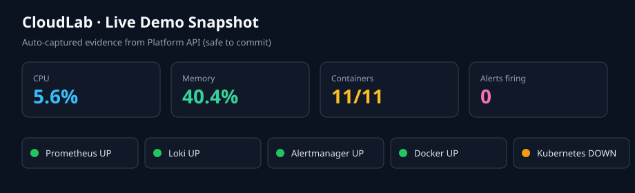
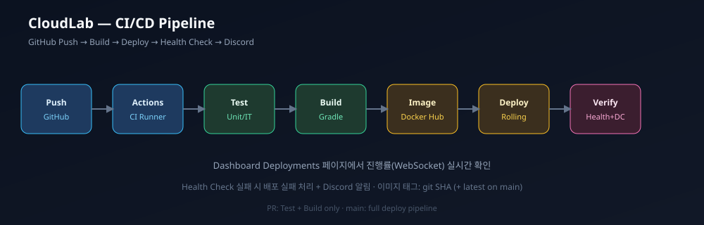
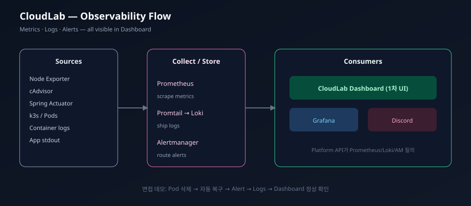

# CloudLab

### Self-Hosted DevOps Platform

<p align="center">
  
</p>

<p align="center">
  <strong>브라우저 하나로 서버 · Kubernetes · Docker · 배포 · 로그 · 모니터링 · 알림을 운영하는<br/>개인용 내부 운영 플랫폼 (Platform Engineering Portfolio)</strong>
</p>

<p align="center">
  <a href="https://github.com/jinhgit/cloudlab/actions/workflows/ci.yml"></a>
  <a href="https://github.com/jinhgit/cloudlab/actions/workflows/cd.yml"></a>
  
</p>

<p align="center">
  
  
  
  
  
  
  
  
</p>

| | |
|---|---|
| **Version** | 1.0 (Steps 1–12 complete) + interview demo kit |
| **Repo** | https://github.com/jinhgit/cloudlab |
| **PRD** | [docs/PRD.md](../docs/PRD.md) |
| **Status** | Self-hosted ops platform MVP — real adapters, Compose stack, CI/CD |
| **5-min demo** | [docs/demo-playbook.md](../docs/demo-playbook.md) · `./scripts/demo-run.sh` |

### Live demo evidence (auto-captured)

<p align="center">
  
</p>

<details>
<summary>최신 API 스냅샷 · 캡처 방법</summary>

- 상태 표: [docs/assets/demo/latest-status.md](../docs/assets/demo/latest-status.md)
- 갱신: `./scripts/demo-capture-status.sh`
- Discord 1회 전송: `./scripts/demo-discord-test.sh` → `docs/assets/demo/discord-alert.png` 저장
- UI 스크린샷 체크리스트: [docs/assets/demo/README.md](../docs/assets/demo/README.md)

</details>


---

## 목차

1. [프로젝트 소개](#1-프로젝트-소개)
2. [왜 CloudLab인가](#2-왜-cloudlab인가)
3. [시스템 아키텍처](#3-시스템-아키텍처)
4. [기술 스택](#4-기술-스택)
5. [프로젝트 구조](#5-프로젝트-구조)
6. [설치 방법](#6-설치-방법)
7. [Docker 구성](#7-docker-구성)
8. [Kubernetes 구성](#8-kubernetes-구성)
9. [CI/CD 파이프라인](#9-cicd-파이프라인)
10. [모니터링 구성](#10-모니터링-구성)
11. [로그 수집 구성](#11-로그-수집-구성)
12. [Dashboard 설명](#12-dashboard-설명)
13. [Backend API 개요](#13-backend-api-개요)
14. [보안](#14-보안)
15. [장애 복구 시나리오](#15-장애-복구-시나리오)
16. [면접 데모 (5분)](#16-면접-데모-5분)
17. [성능 테스트](#17-성능-테스트)
18. [트러블슈팅](#18-트러블슈팅)
19. [테스트](#19-테스트)
20. [개발 로드맵](#20-개발-로드맵)
21. [향후 개선 사항 (v2)](#21-향후-개선-사항-v2)
22. [문서 링크](#22-문서-링크)
23. [커밋 컨벤션](#23-커밋-컨벤션)
24. [라이선스](#24-라이선스)

---

## 1. 프로젝트 소개

**CloudLab**은 상용 클라우드 콘솔(예: AWS Console)처럼 동작하는 **Self-Hosted DevOps / 내부 운영 플랫폼**이다.

웹 브라우저만으로 다음을 수행한다.

| 영역 | 구현 상태 |
|------|-----------|
| 서버 현황 | CPU · Memory · Disk · JVM · 통합 status (`/api/server/status`) |
| Docker | 컨테이너 목록 · Start/Stop/Restart (docker.sock) |
| Kubernetes | Pod/Deployment 목록 · Delete Pod · Restart Deployment (kubeconfig 있을 때) |
| 모니터링 | Prometheus 차트 (Dashboard Recharts + Grafana) |
| 로그 | Loki 검색 · 서비스/키워드 필터 |
| 알림 | Alertmanager firing 목록 · Discord(옵션) |
| 배포 | GitHub Actions run 목록 (토큰 설정 시) · CD 파이프라인 |
| DB / Redis | PostgreSQL size/connections · Redis INFO |

> **웹 서비스가 목적이 아니다.**  
> **DevOps 운영 플랫폼을 설계·구축·운영하는 역량**을 증명하는 것이 목적이다.

| 항목 | 내용 |
|------|------|
| **제품 유형** | Platform Engineer 내부 운영 플랫폼 수준 |
| **포지션** | Cloud / DevOps / Platform / SRE 포트폴리오 |
| **호스팅** | Self-Hosted (Compose 로컬 · k3s 단일 노드) |
| **v1 범위** | Steps **1–12 완료** |

---

## 2. 왜 CloudLab인가

| 구분 | 일반적인 실습 | CloudLab |
|------|----------------|----------|
| 목표 | 스택 나열 | **운영 플랫폼 제품** |
| UI | Grafana만 | **자체 Dashboard** |
| 데이터 | Mock | **실데이터 어댑터** |
| 배포 | 수동 스크립트 | **GitHub Actions CI/CD** |
| 장애 | 문서만 | **Pod 삭제 → 복구 → 알림 → 로그** 스토리 |
| 성장 | 일회성 | **v1 운영 → v2 IaC** |

역량 맵: Linux · Docker · Compose · k3s · Helm · GitHub Actions · Prometheus · Loki · Alertmanager · Nginx · Spring Boot · Next.js · Observability.

---

## 3. 시스템 아키텍처

<p align="center">
  
</p>

```text
Internet → Cloudflare Tunnel (옵션) → Nginx (옵션)
                │
        Next.js Dashboard (:3000)
                │  REST
        Spring Boot Platform API (:8080)
                │
    ┌───────────┼───────────┬────────────┐
 Docker      k3s API    Prometheus    Loki
 Engine                 Alertmanager  Promtail
 PostgreSQL  Redis      Node/cAdvisor
```

### 설계 원칙

1. 브라우저는 Docker socket / kubeconfig / Prometheus 관리자 권한에 **직접 접근하지 않는다**.
2. Platform API **어댑터 패턴** — upstream 실패 시 502 + 원인 메시지.
3. Compose 스택으로 로컬 재현, k3s 매니페스트/Helm으로 클러스터 배포.
4. Metrics **Prometheus first**, Logs **Loki**, UI는 CloudLab Dashboard 1차.

상세: [docs/architecture.md](../docs/architecture.md) · [docs/dashboard-wiring.md](../docs/dashboard-wiring.md)

---

## 4. 기술 스택

<p align="center">
  
</p>

| Layer | Stack |
|-------|--------|
| **Frontend** | Next.js 15, TypeScript, Tailwind v4, shadcn-style UI, React Query, Zustand, Recharts |
| **Backend** | Spring Boot 3.5, Java 21, Security, Actuator, JPA, Redis, docker-java, client-java |
| **Data** | PostgreSQL 16, Redis 7 |
| **DevOps** | Docker, Compose, k3s, Helm, GitHub Actions, Docker Hub |
| **Observability** | Prometheus, Grafana, Loki, Promtail, Alertmanager, Node Exporter, cAdvisor |
| **Edge (문서/옵션)** | Nginx, Cloudflare Tunnel |

---

## 5. 프로젝트 구조

```text
cloudlab/
├── frontend/                 # Next.js Dashboard
├── backend/                  # Spring Boot Platform API (com.cloudlab)
├── docker/                   # Dockerfile.backend / frontend
├── docker-compose.yml        # app stack
├── docker-compose.monitoring.yml
├── docker-compose.logging.yml
├── docker-compose.prod.yml   # CD remote deploy
├── kubernetes/               # manifests + Helm chart
├── monitoring/               # Prometheus · Grafana · Alertmanager
├── logging/                  # Loki · Promtail
├── nginx/                    # reverse proxy (docs)
├── scripts/                  # compose / k8s / ci / iac helpers
├── iac/                      # v2 Terraform + Ansible sketch
├── docs/                     # PRD · architecture · runbooks
├── .github/
│   ├── README.md             # ← 이 문서
│   └── workflows/            # ci.yml · cd.yml
├── AGENTS.md
└── .env.example
```

---

## 6. 설치 방법

### 사전 요구

- Docker + Docker Compose
- (선택) Java 21, Node 22 — 로컬 IDE 개발용
- (선택) kubectl / k3s — 클러스터 배포용

### 풀 스택 (권장)

```bash
git clone https://github.com/jinhgit/cloudlab.git
cd cloudlab
cp .env.example .env

# App + Monitoring + Logging
docker compose \
  -f docker-compose.yml \
  -f docker-compose.monitoring.yml \
  -f docker-compose.logging.yml \
  up -d --build

# 또는 헬퍼
./scripts/logging-up.sh
```

| Service | URL |
|---------|-----|
| **Dashboard** | http://localhost:3000 |
| **Platform API** | http://localhost:8080/api/server/status |
| **Actuator** | http://localhost:8080/actuator/health |
| **Prometheus** | http://localhost:9090/targets |
| **Grafana** | http://localhost:3001 (admin / `.env`) |
| **Loki** | http://localhost:3100/ready |
| **Alertmanager** | http://localhost:9093 |

### 개별 개발

```bash
# Backend
export JAVA_HOME="$(/usr/libexec/java_home -v 21 2>/dev/null || echo $JAVA_HOME)"
cd backend && ./gradlew bootRun

# Frontend
cd frontend && cp .env.example .env.local && npm ci && npm run dev
```

중지:

```bash
./scripts/logging-down.sh
# 볼륨 포함: ./scripts/logging-down.sh -v
```

---

## 7. Docker 구성

| 파일 | 역할 |
|------|------|
| [`docker/Dockerfile.backend`](../docker/Dockerfile.backend) | Java 21 multi-stage, non-root 10001, healthcheck |
| [`docker/Dockerfile.frontend`](../docker/Dockerfile.frontend) | Next standalone, Node 22 |
| [`scripts/docker-build.sh`](../scripts/docker-build.sh) | 로컬 이미지 빌드 |
| Compose | 로컬 오케스트레이션 + `docker.sock` (API lab) |

```bash
./scripts/docker-build.sh all local
```

설계: [docs/docker.md](../docs/docker.md) · [docs/compose.md](../docs/compose.md)

**주의 (lab):** Compose backend는 Docker Engine API 접근을 위해 `user: "0:0"` + `docker.sock` 마운트를 사용한다. 운영에서는 socket proxy / 최소 권한 그룹을 권장한다.

---

## 8. Kubernetes 구성

| 항목 | 내용 |
|------|------|
| 런타임 | **k3s** |
| Manifests | `kubernetes/manifests/` + `kustomization.yaml` |
| Helm | `kubernetes/helm/cloudlab/` |
| 노출 | NodePort UI **30080** · API **30088** · Ingress `cloudlab.local` |

```bash
./scripts/k8s-import-images.sh local
./scripts/k8s-apply.sh manifests   # 또는 helm
kubectl -n cloudlab get pods
```

면접 복구 데모:

```bash
kubectl -n cloudlab delete pod -l app.kubernetes.io/name=cloudlab-backend
kubectl -n cloudlab get pods -w
```

상세: [docs/kubernetes.md](../docs/kubernetes.md)

---

## 9. CI/CD 파이프라인

<p align="center">
  
</p>

```text
Push/PR → CI: Gradle test · Vitest · Next build · Docker build
main    → CD: gate → Registry push (SHA+latest)
            → optional SSH deploy → health → Discord
```

| Workflow | 파일 |
|----------|------|
| CI | [`.github/workflows/ci.yml`](workflows/ci.yml) |
| CD | [`.github/workflows/cd.yml`](workflows/cd.yml) |

### Secrets (선택/필수)

| Secret | 용도 |
|--------|------|
| `DOCKERHUB_USERNAME` / `TOKEN` | 이미지 push |
| `DEPLOY_HOST` / `SSH_KEY` | 원격 배포 |
| `DISCORD_WEBHOOK_URL` | CD 알림 |

미설정 시: push/deploy/notify 단계는 **스킵** (실패로 처리하지 않음).

상세: [docs/cicd.md](../docs/cicd.md)

---

## 10. 모니터링 구성

<p align="center">
  
</p>

| Component | Port | 역할 |
|-----------|------|------|
| Prometheus | 9090 | scrape · rules |
| Grafana | 3001 | 보조 대시보드 (CloudLab Overview) |
| Alertmanager | 9093 | 알림 라우팅 |
| Node Exporter | 9100 | 호스트 메트릭 |
| cAdvisor | 8081 | 컨테이너 메트릭 |
| Spring Actuator | `/actuator/prometheus` | JVM · HTTP |

```bash
./scripts/monitoring-up.sh
# http://localhost:9090/targets  — 모든 job up 확인
```

Alert rules: backend down, target down, node CPU/memory pressure.

상세: [docs/monitoring.md](../docs/monitoring.md)

---

## 11. 로그 수집 구성

| Component | Port | 역할 |
|-----------|------|------|
| Loki | 3100 | 저장 · Query API |
| Promtail | 9080 | Docker SD → Loki |
| Grafana Explore | 3001 | LogQL |

```bash
./scripts/logging-up.sh
# LogQL: {compose_service="backend"}
```

라벨: `compose_project=cloudlab`, `compose_service`, `container`, `level` …  
보존: 7일.

상세: [docs/logging.md](../docs/logging.md)

---

## 12. Dashboard 설명

<p align="center">
  
</p>

- **다크 모드 기본** · shadcn-style + Tailwind  
- 좌측 Sidebar (PRD 고정 순서) + Header (API health badge)

| Menu | 데이터 소스 |
|------|-------------|
| Dashboard | `/api/server/status` |
| Kubernetes | `/api/kubernetes/*` |
| Docker | `/api/docker/*` |
| Deployments | `/api/deployments` (GitHub) |
| Monitoring | `/api/prometheus/*` + Recharts |
| Logs | `/api/logs` (Loki) |
| Database | `/api/database/status` |
| Redis | `/api/redis/status` |
| Alerts | `/api/alerts` |
| Settings | Zustand local (API URL, polling) |

상세: [docs/frontend.md](../docs/frontend.md) · [docs/dashboard-wiring.md](../docs/dashboard-wiring.md)

---

## 13. Backend API 개요

공통 envelope:

```json
{ "success": true, "data": {}, "error": null }
```

| Method | Path | 설명 |
|--------|------|------|
| GET | `/api/health` | API 생존 |
| GET | `/api/platform/info` | 버전 정보 |
| GET | `/api/server/status` | 통합 현황 |
| GET/POST/DELETE | `/api/docker/containers…` | Docker Engine |
| GET/POST/DELETE | `/api/kubernetes/…` | k8s |
| GET | `/api/prometheus/query[_range]` | PromQL |
| GET | `/api/logs` | LogQL |
| GET | `/api/alerts` | Alertmanager |
| GET | `/api/deployments` | GitHub Actions |
| GET | `/api/database/status` | PostgreSQL |
| GET | `/api/redis/status` | Redis |
| GET | `/actuator/health` | liveness/readiness |
| GET | `/actuator/prometheus` | scrape target |

상세: [docs/api-contract.md](../docs/api-contract.md) · [docs/backend.md](../docs/backend.md)

---

## 14. 보안

| 통제 | v1 상태 |
|------|---------|
| 브라우저 → 인프라 직접 접근 | **금지** (API only) |
| CORS | `CLOUDLAB_CORS_ORIGINS` |
| Lab open API | `cloudlab.security.open-api=true` (데모 기본) |
| Secrets | `.env` / GitHub Secrets — 레포 커밋 금지 |
| Docker socket | Compose lab에서 root 마운트 (운영 시 축소 권장) |
| JWT ADMIN/VIEWER | 구조 준비 · **본격 강제화는 후속** |

운영에서는 `CLOUDLAB_SECURITY_OPEN_API=false` 후 JWT를 활성화한다.

---

## 15. 장애 복구 시나리오

1. Dashboard에서 정상 상태 확인  
2. `kubectl -n cloudlab delete pod -l app.kubernetes.io/name=cloudlab-backend` (또는 Docker stop)  
3. Deployment 컨트롤러 / Compose restart 로 자동 복구  
4. Alertmanager → Discord (설정 시)  
5. Logs 화면에서 장애·복구 구간 확인  
6. Monitoring · Dashboard에서 정상 복귀 확인  

스크립트: [docs/demo-scenario.md](../docs/demo-scenario.md)

---

## 16. 면접 데모 (5분)

### 원커맨드

```bash
./scripts/demo-reset.sh              # 스택 정상화
./scripts/demo-run.sh --preflight    # 사전 점검
./scripts/demo-run.sh                # 5분 큐 카드 (Enter로 시작)
./scripts/demo-capture-status.sh     # 증거 스냅샷 갱신
# Discord 실제 1회 (웹훅 필요)
# export DISCORD_WEBHOOK_URL='https://discord.com/api/webhooks/...'
# ./scripts/demo-discord-test.sh
```

| # | 액션 |
|---|------|
| 1 | Dashboard — CPU/Mem, containers, integrations badge |
| 2 | GitHub Actions 초록 런 + README CI/CD 배지 |
| 3 | Monitoring 실시간 차트 |
| 4 | Docker restart 또는 Pod 삭제 (장애 주입) |
| 5 | Alerts + Discord 메시지 |
| 6 | Logs (Loki) |
| 7 | Dashboard 정상 복귀 클로징 |

전체 대본·백업 플랜: [docs/demo-playbook.md](../docs/demo-playbook.md)

---

## 17. 성능 테스트

| 항목 | 방법 | 참고 수치 (lab) |
|------|------|-----------------|
| API health | curl | 보통 &lt; 50ms 로컬 |
| Overview | `/api/server/status` | multi-upstream 집계 |
| Frontend build | `npm run build` | ~수 초 (CI) |
| Backend test | `./gradlew test` | MockMvc suite |
| Polling 부하 | Dashboard 5s interval | Settings에서 조정 |

부하 테스트(k6) 정량 SLA는 서버 스펙과 함께 확장 시 `docs/`에 기록한다.

---

## 18. 트러블슈팅

| 증상 | 확인 |
|------|------|
| Dashboard API Offline | `NEXT_PUBLIC_API_URL`, backend health, CORS |
| Docker page 502 | `docker.sock` 마운트, backend 로그 `Docker engine` |
| 메트릭 공백 | Prometheus targets, `CLOUDLAB_PROMETHEUS_URL=http://prometheus:9090` |
| 로그 없음 | Promtail/Loki ready, LogQL `compose_project="cloudlab"` |
| k8s empty | kubeconfig / 클러스터 연결 |
| CD no push | `DOCKERHUB_*` secrets |
| CI workflow push 거부 | `gh auth refresh -s workflow` |

```bash
docker compose ps
curl -s http://localhost:8080/actuator/health
curl -s http://localhost:9090/-/ready
curl -s http://localhost:3100/ready
```

---

## 19. 테스트

```bash
# Backend
cd backend && ./gradlew test

# Frontend unit
cd frontend && npm test

# E2E smoke (Compose UI must be up)
./scripts/demo-reset.sh && cd frontend && npx playwright install chromium && npm run test:e2e

# Script smoke
./scripts/ci/health-check.test.sh
```

| 영역 | 도구 |
|------|------|
| Backend | JUnit 5, MockMvc, Mockito |
| Frontend | Vitest, Testing Library |
| E2E | Playwright · `e2e/dashboard-smoke.spec.ts` (Compose UI) |
| CI | Gradle test · npm test · health-check smoke |

상세: [docs/testing.md](../docs/testing.md)

---

## 20. 개발 로드맵

| Step | 내용 | 상태 |
|------|------|------|
| 1 | 프로젝트 구조 · PRD | **Done** |
| 2 | Dockerfiles | **Done** |
| 3 | Spring Boot API | **Done** |
| 4 | Next.js Dashboard shell | **Done** |
| 5 | Docker Compose | **Done** |
| 6 | Kubernetes (k3s/Helm) | **Done** |
| 7 | Monitoring | **Done** |
| 8 | Logging | **Done** |
| 9 | CI/CD | **Done** |
| 10 | Dashboard 실연동 | **Done** |
| 11 | 테스트 강화 | **Done** |
| 12 | README 최종 | **Done** |

진행 기록: [docs/development-plan.md](../docs/development-plan.md)

---

## 21. 향후 개선 사항 (v2)

### v2 IaC 스케치 (구현됨 — scaffold)

| 경로 | 역할 |
|------|------|
| [`iac/terraform/`](../iac/terraform/) | VPC · SG · EC2 모듈 + `envs/lab` |
| [`iac/ansible/`](../iac/ansible/) | common · docker · k3s · cloudlab_app |
| [`scripts/iac-bootstrap.sh`](../scripts/iac-bootstrap.sh) | plan/apply → inventory → bootstrap |
| [docs/v2-iac.md](../docs/v2-iac.md) | 설계 · 경계 · 성공 기준 |

```bash
# 항상 무료 ($0) — 권장
./scripts/iac-free-check.sh

# Free Tier apply는 기본 차단. 문서 숙지 후에만:
# I_UNDERSTAND_AWS_MAY_CHARGE=yes ./scripts/iac-apply-free-tier.sh
```

**과금:** AWS EC2는 영구 무료가 아닙니다. Free Tier 한도·실수 시 유료.  
상세 체크리스트: [docs/v2-aws-free-checklist.md](../docs/v2-aws-free-checklist.md)

### 이어서 할 일

| 항목 | 설명 |
|------|------|
| Free Tier 실 apply (선택) | micro만 · 당일 destroy · 예산 알림 |
| JWT RBAC 강제 | ADMIN / VIEWER |
| Playwright E2E | Compose UI |
| Docker socket proxy | root 마운트 제거 |

스토리: **v1 운영 플랫폼 → v2 IaC 플랫폼 (스케치 완료)**.

---

## 22. 문서 링크

| 문서 | 링크 |
|------|------|
| PRD | [docs/PRD.md](../docs/PRD.md) |
| Architecture | [docs/architecture.md](../docs/architecture.md) |
| Backend | [docs/backend.md](../docs/backend.md) |
| Frontend | [docs/frontend.md](../docs/frontend.md) |
| Compose | [docs/compose.md](../docs/compose.md) |
| Kubernetes | [docs/kubernetes.md](../docs/kubernetes.md) |
| Monitoring | [docs/monitoring.md](../docs/monitoring.md) |
| Logging | [docs/logging.md](../docs/logging.md) |
| CI/CD | [docs/cicd.md](../docs/cicd.md) |
| Dashboard wiring | [docs/dashboard-wiring.md](../docs/dashboard-wiring.md) |
| Testing | [docs/testing.md](../docs/testing.md) |
| v2 IaC | [docs/v2-iac.md](../docs/v2-iac.md) · [iac/](../iac/) |
| Demo | [docs/demo-scenario.md](../docs/demo-scenario.md) |
| AI contract | [AGENTS.md](../AGENTS.md) |

---

## 23. 커밋 컨벤션

```text
feat: fix: docs: refactor: test: ci: infra: monitoring: logging:
```

- 제목·본문: **한국어 메인** (기술 용어는 영어 OK)  
- 큼지막한 Step 완료 시 commit + push  

---

## 24. 라이선스

Portfolio project · [jinhgit/cloudlab](https://github.com/jinhgit/cloudlab)

---

<p align="center">
  <sub>CloudLab — Build the platform, not just the app.</sub>
</p>
