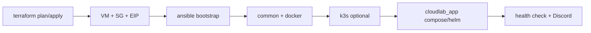

# CloudLab v2 — Infrastructure as Code (Sketch)

**Status:** Sketch / scaffold (portfolio roadmap)  
**Goal:** One path from **empty cloud account → VM → Docker/k3s → CloudLab stack → Observability**

```text
v1  CloudLab Ops Platform (this repo, Compose + k3s + Dashboard)
        │
        ▼
v2  IaC bootstrap layer
    Terraform  → network + compute + firewall + SSH key
    Ansible    → OS harden + Docker + k3s + CloudLab deploy
    Scripts    → plan / apply / configure orchestration
```

## Why v2

| v1 | v2 |
|----|-----|
| “플랫폼을 운영한다” | “플랫폼이 돌아갈 **인프라를 코드로 만든다**” |
| 수동/Compose 기동 | **재현 가능한 프로비저닝** |
| 단일 랩탑 데모 | **클라우드 1노드 lab → multi-env 확장 가능 구조** |

면접 스토리:

1. v1에서 운영 콘솔·관측·CI/CD를 증명했다.  
2. v2는 같은 산출물을 **버튼(스크립트) 한 번으로 빈 서버에 올린다**.  
3. Terraform = desired infra state, Ansible = desired machine state.

## Directory layout

```text
iac/
├── README.md
├── terraform/
│   ├── modules/
│   │   ├── network/          # VPC + subnet + IGW (AWS sketch)
│   │   ├── security_group/   # SSH / HTTP / HTTPS / NodePort
│   │   └── compute/          # EC2 + EIP + cloud-init
│   └── envs/
│       └── lab/              # single-node lab environment
│           ├── main.tf
│           ├── variables.tf
│           ├── outputs.tf
│           ├── providers.tf
│           └── terraform.tfvars.example
└── ansible/
    ├── ansible.cfg
    ├── inventory/
    │   └── lab.example.ini
    ├── group_vars/
    │   └── all.yml
    ├── playbooks/
    │   ├── bootstrap.yml     # full sequence
    │   └── site.yml          # configure only
    └── roles/
        ├── common/
        ├── docker_host/
        ├── k3s_node/
        └── cloudlab_app/
```

## Bootstrap flow



```bash
# 1) Infra
cd iac/terraform/envs/lab
cp terraform.tfvars.example terraform.tfvars   # edit
terraform init
terraform plan
terraform apply

# 2) Configure (inventory from terraform output or manual)
cd ../../../ansible
# edit inventory/lab.ini with public_ip
ansible-playbook -i inventory/lab.ini playbooks/bootstrap.yml

# Or one helper from repo root:
./scripts/iac-bootstrap.sh
```

## Module contracts

### Terraform `network`

| Input | Output |
|-------|--------|
| `cidr`, `az` | `vpc_id`, `subnet_id` |

### Terraform `security_group`

| Ingress (lab) | Purpose |
|---------------|---------|
| 22 | SSH |
| 80/443 | HTTP(S) / Tunnel |
| 3000, 8080 | CloudLab UI/API (tighten in prod) |
| 30080, 30088 | k3s NodePort (optional) |

### Terraform `compute`

| Input | Output |
|-------|--------|
| `instance_type`, `ami`, `key_name`, `user_data` | `instance_id`, `public_ip` |

`user_data` installs base packages only; **heavy config stays in Ansible** (clear boundary).

### Ansible roles

| Role | Responsibility |
|------|----------------|
| `common` | timezone, packages, ufw basics, users |
| `docker_host` | Docker Engine + Compose plugin |
| `k3s_node` | optional single-node k3s |
| `cloudlab_app` | clone/sync repo, `.env`, `compose up` or helm |

## Security notes (sketch)

- **No real secrets in git** — `*.tfvars`, `inventory/*.ini` with hosts, ansible vault later.
- Lab opens broad ports; production must restrict SG + open-api=false + JWT.
- SSH key only; disable password auth in `common` role.
- Terraform state: local by default; remote S3+Dynamo recommended before team use.

## Out of scope (this sketch)

- Multi-AZ HA / EKS / managed DB
- Full multi-cloud (GCP/Azure modules)
- Production cost optimization
- Automated DNS + ACM certificates (documented as next)

## Mapping to v1 artifacts

| v1 path | Consumed by v2 |
|---------|----------------|
| `docker-compose*.yml` | `cloudlab_app` role |
| `kubernetes/` | `k3s_node` + helm apply |
| `scripts/ci/*` | post-deploy health |
| `.env.example` | template on host |

## Success criteria (when implementing for real)

1. `terraform apply` creates reachable SSH host.  
2. `ansible-playbook bootstrap.yml` leaves CloudLab Dashboard responding on `:3000`.  
3. `/api/server/status` shows prometheus/loki/docker flags.  
4. Destroy path: `terraform destroy` leaves no orphan lab resources.

---

*CloudLab v2 sketch — Infrastructure as Code layer above the v1 ops platform.*
